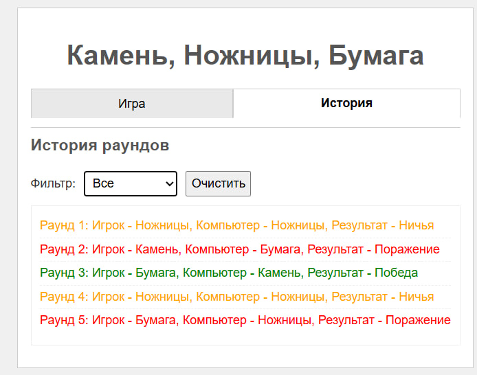

# Отчет по индивидуальному проекту: Реализация игры "Камень, ножницы, бумага", используя JS, HTML и CSS.

## Автор проекта:
- Балев Вадим
- Студент группы I2402

## Инструкции по установке и запуску проекта
Для установки и запуска проекта не требуется никаких сторонних зависимостей, кроме современного веб-браузера.

Основные шаги для запуска приложения:

- Установите папку с проектом.

- Используйте локальный веб-сервер: Поскольку проект использует JavaScript модули `<script type="module">`, его необходимо запускать через локальный веб-сервер, а не просто открывать файл index.html напрямую в браузере.
    - Рекомендуемый способ: Используйте расширение "Live Server" в Visual Studio Code. Откройте папку проекта в VS Code, кликните правой кнопкой мыши по index.html и выберите "Open with Live Server".
    - Альтернативные способы: Можно использовать локальный сервер Node.js.
- Откройте приложение: После запуска сервера браузер автоматически откроет (через Live Server) или вам нужно будет перейти по адресу, который предоставит сервер.

# Цель проекта:

Цель проекта — развить и подтвердить практические навыки программирования на JavaScript, включая работу с DOM, событиями, обработкой данных, пользовательским вводом и организацией кода в модульной структуре. Проект должен показать умение создавать интерактивные, понятные и поддерживаемые интерфейсы без использования сторонних фреймворков.

# Ход работы:
## Общее описание проекта
- Игра против бота: Пользователь может выбрать "Камень", "Ножницы" или "Бумагу", кликнув по соответствующей кнопке. Компьютер делает случайный выбор.
- Определение и отображение результата: После каждого хода определяется победитель раунда (игрок, компьютер или ничья), и результат отображается на странице.
- Подсчет и отображение счета: Ведется счет побед игрока и компьютера, который обновляется и показывается после каждого раунда.
- История раундов: Результаты каждого сыгранного раунда сохраняются в массив объектов (история), который доступен для просмотра.
- Просмотр и фильтрация истории: История раундов отображается в виде простого списка. Пользователь может отфильтровать записи истории по результату раунда (показать только победы, поражения, ничьи или все раунды).
- Очистка истории: Предоставляется возможность очистить всю историю сыгранных раундов.
- Интерактивный интерфейс: Используются вкладки для переключения между основным игровым полем и экраном истории раундов.
- Адаптивный дизайн: Интерфейс имеет базовую адаптивность для удобного использования на различных устройствах.

**Код**
- Проект структурирован с использованием модульного подхода. Код разделен на три основных файла: script.js (главный координатор), game.js (логика игры и данных) и ui.js (управление интерфейсом).

## Реализация кода

## script.js

Этот файл является точкой входа приложения. Он инициализирует игру, получает ссылки на элементы DOM, настраивает основные обработчики событий и координирует взаимодействие между модулями game.js и ui.js.

---
### Импорт модулей
Импортируются функции, необходимые для работы, из модулей game.js и ui.js. Это позволяет использовать логику и функции управления UI, определенные в других файлах.

```js

import {
    playGameRound, 
    getScores,
    getHistoryData,
    resetGame
} from "./src/game.js";

import {
    updateGameUI, 
    renderHistoryList, 
    setupTabs, 
    isValidFilterValue 
} from "./src/ui.js";
```


### Получение ссылок на элементы DOM

Фрагмент кода позволяет получить ссылки на ключевые элементы HTML страницы, используя их уникальные идентификаторы или селекторы классов. Эти ссылки будут использоваться для манипуляции элементами интерфейса (обновление текста, добавление элементов, настройка слушателей событий).

```js
const scoreDiv = document.getElementById('score');
const resultDiv = document.getElementById('result');
const choicesDiv = document.getElementById('choices');
const historyListDiv = document.getElementById('historyList');
const historyFilterSelect = document.getElementById('historyFilter');
const clearHistoryButton = document.getElementById('clearHistory');
const tabButtons = document.querySelectorAll('.tab-button');
const tabContents = document.querySelectorAll('.tab-content');
```

### Слушатель событий для выбора игрока (делегирование)

Настраивает один слушатель события click на родительском элементе #choices. При клике внутри этого элемента, он проверяет, был ли клик именно по кнопке с атрибутом data-choice. Если да, то он получает значение data-choice (выбор игрока) и вызывает функцию handlePlayerChoice для обработки этого выбора. Это пример делегирования событий.
```js
choicesDiv.addEventListener('click', (event) => {
    const target = event.target;
   
    if (target.tagName === 'BUTTON' && target.dataset.choice) {
        const playerChoice = target.dataset.choice; 
        handlePlayerChoice(playerChoice); 
    }
});
```

### Слушатель событий для изменения фильтра истории

Настраивается слушатель события change на выпадающем списке #historyFilter. При изменении выбранного значения фильтра, он получает новое значение, выполняет его простую валидацию и вызывает функцию updateHistoryDisplay для обновления списка истории с учетом нового фильтра.
```js
historyFilterSelect.addEventListener('change', (event) => {
    const filterValue = event.target.value;
    
    if (!isValidFilterValue(filterValue)) {
        console.warn("Некорректное значение фильтра:", filterValue); 
        event.target.value = 'all'; 
        updateHistoryDisplay('all'); 
    } else {
         updateHistoryDisplay(filterValue); 
    }
});
```

### Слушатель событий для кнопки очистки истории

Настраивает слушатель события click на кнопке #clearHistory. При клике, он вызывает функцию resetGame из модуля game.js для сброса состояния игры и очистки данных истории, затем сбрасывает значение фильтра в UI и вызывает updateHistoryDisplay для обновления отображения (которое теперь будет пустым).
```js

clearHistoryButton.addEventListener('click', () => {
    resetGame(); 
    updateGameUI(scoreDiv, resultDiv, getScores()); 
    historyFilterSelect.value = 'all';
    updateHistoryDisplay('all'); 
});
```

### function handlePlayerChoice(playerChoice)

Это функция, вызываемая при клике на кнопку выбора игрока. Она запускает логику одного раунда игры, вызывая playGameRound из game.js. Затем она получает обновленный счет и данные сыгранного раунда и вызывает функции обновления UI (updateGameUI и updateHistoryDisplay) для отображения изменений на странице.
```js


/**
 * Обрабатывает выбор игрока, запускает раунд и обновляет UI.
 * @param {string} playerChoice - Выбор игрока ('rock', 'paper', 'scissors').
 */
function handlePlayerChoice(playerChoice) {
   
    const roundResult = playGameRound(playerChoice);

    
    updateGameUI(scoreDiv, resultDiv, getScores(), roundResult);

    
    updateHistoryDisplay(historyFilterSelect.value);
}
```

### function updateHistoryDisplay(filterValue)

Это функция, отвечающая за получение актуальных данных истории (с учетом текущего фильтра) и передачу их в функцию рендеринга UI (renderHistoryList) для отображения на странице.
```js
/**
 * Обновляет отображение списка истории на основе текущего фильтра.
 * @param {string} filterValue - Значение фильтра ('all', 'win', 'lose', 'draw').
 */
function updateHistoryDisplay(filterValue) {
     
     const filteredHistory = getHistoryData(filterValue);
    
     renderHistoryList(historyListDiv, filteredHistory);
}
```

### function initializeGame()

Это функция, запускаемая один раз при полной загрузке DOM страницы. Она выполняет начальную настройку игры: устанавливает начальное состояние UI (счет, результат), отображает пустую историю и настраивает переключение вкладок.
```js


/**
 * Инициализирует игру при загрузке страницы.
 */
function initializeGame() {
    console.log("Game Initialized (Simple)");
    
    updateGameUI(scoreDiv, resultDiv, getScores()); 
    
    updateHistoryDisplay(historyFilterSelect.value);
    setupTabs(tabButtons, tabContents); 

}
```

### Запуск инициализации

Настраивается слушатель события DOMContentLoaded, чтобы убедиться, что функция initializeGame будет вызвана только после того, как вся HTML-структура страницы будет полностью загружена и готова к работе скрипта.
```js

document.addEventListener('DOMContentLoaded', initializeGame);
```

## game.js
Модуль game.js содержит логику самой игры (выбор компьютера, определение победителя) и управляет состоянием игры и массивом данных истории.


### Состояние игры

Объявляет переменные, которые хранят текущее состояние игры: счет игрока и компьютера, номер текущего раунда, и массив history для хранения записей о каждом сыгранном раунде в виде объектов.
```js

/**
 * @typedef {object} RoundHistory
 * @property {number} round - Номер раунда.
 * @property {string} player - Выбор игрока ('rock', 'paper', 'scissors').
 * @property {string} computer - Выбор компьютера ('rock', 'paper', 'scissors').
 * @property {'win'|'lose'|'draw'} result - Результат раунда ('win', 'lose', 'draw').
 */


let playerScore = 0;
let computerScore = 0;
let roundNumber = 0;
/** @type {RoundHistory[]} */ 
let history = []; 
```

### Функция getComputerChoice()

Функция, которая возвращает случайный выбор для компьютера ('rock', 'paper', или 'scissors'). Использует Math.random() для генерации случайного числа и выбирает соответствующий элемент из предопределенного массива вариантов.
```js
/**
 * Возвращает случайный выбор компьютера.
 * @returns {'rock'|'paper'|'scissors'} Случайный выбор компьютера.
 */
function getComputerChoice() {
    const choices = ['rock', 'paper', 'scissors'];
    const randomIndex = Math.floor(Math.random() * choices.length); 
    return choices[randomIndex]; 
}
```

### function determineWinner(playerChoice, computerChoice)

Функция, которая принимает выборы игрока и компьютера в виде строк и возвращает результат раунда ('win' - победа игрока, 'lose' - поражение игрока, или 'draw' - ничья) согласно правилам игры "Камень, ножницы, бумага".
```js

/**
 * Определяет победителя раунда.
 * @param {string} playerChoice - Выбор игрока ('rock', 'paper', 'scissors').
 * @param {string} computerChoice - Выбор компьютера ('rock', 'paper', 'scissors').
 * @returns {'win'|'lose'|'draw'} Результат раунда для игрока.
 */
function determineWinner(playerChoice, computerChoice) {
    if (playerChoice === computerChoice) {
        return 'draw'; 
    }

    
    if (
        (playerChoice === 'rock' && computerChoice === 'scissors') ||
        (playerChoice === 'paper' && computerChoice === 'rock') ||
        (playerChoice === 'scissors' && computerChoice === 'paper')
    ) {
        return 'win'; 
    } else {
        return 'lose'; 
    }
}
```

### function playGameRound(playerChoice)

Это основная функция игровой логики, экспортируемая из модуля. Она принимает выбор игрока, запускает определение выбора компьютера и победителя, обновляет счетчики playerScore и computerScore, добавляет подробную запись о раунде (включая номер раунда, выборы и результат) в массив history, и возвращает объект с данными этого раунда.
```js

/**
 * Запускает один раунд игры, обновляет счет и историю.
 * @param {string} playerChoice - Выбор игрока ('rock', 'paper', 'scissors').
 * @returns {RoundHistory} Объект с деталями прошедшего раунда.
 */
export function playGameRound(playerChoice) {
    roundNumber++; 

    const computerChoice = getComputerChoice(); 
    const result = determineWinner(playerChoice, computerChoice); 

   
    if (result === 'win') {
        playerScore++;
    } else if (result === 'lose') {
        computerScore++;
    }

    
    const roundData = {
        round: roundNumber,
        player: playerChoice,
        computer: computerChoice,
        result: result
    };
    history.push(roundData);

    return roundData; 
}
```

### export function getScores()

Экспортируемая функция, которая просто возвращает текущие значения счета игрока и компьютера в виде объекта. Используется модулем script.js для получения данных счета для обновления UI.
```js

/**
 * Возвращает текущий счет.
 * @returns {{player: number, computer: number}} Объект со счетом игрока и компьютера.
 */
export function getScores() {
    return {
        player: playerScore,
        computer: computerScore
    };
}
```

### function getHistoryData(filter = 'all')

Экспортируемая функция, которая возвращает массив history. Если указан параметр filter ('win', 'lose', 'draw'), то возвращается только подмножество раундов, соответствующих этому результату, используя метод filter(). Если filter равен 'all' или не указан, возвращается копия всего массива истории.
```js

/**
 * Возвращает массив истории игр, опционально отфильтрованный.
 * @param {'all'|'win'|'lose'|'draw'} [filter='all'] - Значение фильтра.
 * @returns {RoundHistory[]} Отфильтрованный массив истории.
 */
export function getHistoryData(filter = 'all') {
    if (filter === 'all') {
        return [...history]; 
    } else {
     
        return history.filter(round => round.result === filter);
    }
}
```

### function resetGame()

Экспортируемая функция, которая сбрасывает все переменные состояния игры к их начальным значениям (счеты в 0, номер раунда в 0) и очищает массив history. Используется при клике на кнопку "Очистить историю".
```js

/**
 * Сбрасывает счет и историю игр.
 */
export function resetGame() {
    playerScore = 0;
    computerScore = 0;
    roundNumber = 0;
    history = []; 
}
```

## ui.js

Модуль ui.js отвечает за обновление элементов пользовательского интерфейса и управление их отображением (например, переключение вкладок).

### Импорт типа для JSDoc

Импортирует определение типа RoundHistory из game.js. Это нужно только для документации JSDoc в ui.js, чтобы правильно описать параметры функций, принимающих объекты истории, даже если само определение типа находится в другом файле. На исполнение кода это не влияет.

```js

/**
 * @typedef {import("./game.js").RoundHistory} RoundHistory 
 */
```

### function updateGameUI(scoreElement, resultElement, scores, lastRoundData)

Экспортируемая функция, которая принимает ссылки на элементы счета и результата, текущие данные счета и (опционально) данные последнего сыгранного раунда. Она обновляет текстовое содержимое элементов счета и формирует сообщение о результате раунда, отображая его в соответствующем элементе.

```js
/**
 * Обновляет текстовое отображение счета и результата раунда.
 * @param {HTMLElement} scoreElement - Элемент для отображения счета.
 * @param {HTMLElement} resultElement - Элемент для отображения результата раунда.
 * @param {{player: number, computer: number}} scores - Объект с текущим счетом.
 * @param {RoundHistory} [lastRoundData] - Объект с данными последнего раунда (необязательно).
 */
export function updateGameUI(scoreElement, resultElement, scores, lastRoundData) {
   
    scoreElement.textContent = `Счет: ${scores.player} - ${scores.computer}`;

   
    if (lastRoundData) {
        let resultText = `Раунд ${lastRoundData.round}: Вы выбрали ${choiceToText(lastRoundData.player)}, Компьютер выбрал ${choiceToText(lastRoundData.computer)}. `;
        if (lastRoundData.result === 'win') {
            resultText += 'Вы победили!';
        } else if (lastRoundData.result === 'lose') {
            resultText += 'Вы проиграли.';
        } else {
            resultText += 'Ничья.';
        }
        resultElement.textContent = resultText;
    } else {
         
         resultElement.textContent = 'Сделайте ваш выбор.';
    }
}
```

### function renderHistoryList(containerElement, historyData)

Экспортируемая функция, отвечающая за отображение массива данных истории в виде простого текстового списка на странице. Она сначала очищает текущее содержимое элемента-контейнера списка, а затем проходит по переданному массиву historyData, создавая для каждого объекта истории новый HTML-элемент (<p>) и добавляя его в контейнер.

```js
/**
 * Рендерит список истории раундов в указанный DOM-элемент.
 * @param {HTMLElement} containerElement - Элемент, куда рендерить список истории (например, div).
 * @param {RoundHistory[]} historyData - Массив объектов истории раундов для отображения.
 */
export function renderHistoryList(containerElement, historyData) {
    containerElement.innerHTML = ''; 

    if (historyData.length === 0) {
        containerElement.textContent = 'История пуста.'; 
        return;
    }

    
    historyData.forEach(round => {
        const roundElement = document.createElement('p'); 
        roundElement.textContent = `Раунд ${round.round}: Игрок - ${choiceToText(round.player)}, Компьютер - ${choiceToText(round.computer)}, Результат - ${resultToText(round.result)}`;
        roundElement.style.color = resultColor(round.result); 

        containerElement.gameendChild(roundElement); 
    });
}
```

### function setupTabs(tabButtons, tabContents)

Экспортируемая функция, которая принимает NodeList кнопок вкладок и элементов содержимого. Она настраивает слушатели событий click на каждой кнопке вкладки (кроме кнопки "Как играть?" в предыдущем варианте, здесь ее нет, поэтому просто на всех). При клике вызывается функция showTab для показа соответствующей вкладки. Также устанавливает начальную активную вкладку при загрузке.
```js
/**
 * Настраивает переключение между вкладками.
 * @param {NodeListOf<HTMLButtonElement>} tabButtons - NodeList кнопок вкладок.
 * @param {NodeListOf<HTMLElement>} tabContents - NodeList элементов содержимого вкладок.
 */
export function setupTabs(tabButtons, tabContents) {
    tabButtons.forEach(button => {
        button.addEventListener('click', () => {
            const targetTabId = button.dataset.tab; 
            showTab(targetTabId, tabButtons, tabContents); и
        });
    });

    
     const initialActiveTab = document.querySelector('.tab-button.active');
     if (initialActiveTab) {
         showTab(initialActiveTab.dataset.tab, tabButtons, tabContents);
     } else {
        
          if (tabButtons.length > 0) {
              showTab(tabButtons[0].dataset.tab, tabButtons, tabContents);
          }
     }
}
```

### function showTab(targetTabId, tabButtons, tabContents)

Экспортируемая функция, которая управляет видимостью содержимого вкладок и активным состоянием их кнопок. Принимает ID вкладки для показа и NodeList всех кнопок/контента. Удаляет класс active и hidden у неактивных вкладок/кнопок и добавляет их активной.

```js
/**
 * Показывает вкладку с указанным ID и скрывает остальные.
 * @param {string} targetTabId - ID вкладки для показа (например, 'game', 'history').
 * @param {NodeListOf<HTMLButtonElement>} tabButtons - NodeList кнопок вкладок.
 * @param {NodeListOf<HTMLElement>} tabContents - NodeList элементов содержимого вкладок.
 */
export function showTab(targetTabId, tabButtons, tabContents) {
   
    tabButtons.forEach(button => {
        if (button.dataset.tab === targetTabId) {
            button.classList.add('active'); 
        } else {
            button.classList.remove('active'); 
        }
    });

    
    tabContents.forEach(content => {
        if (content.id === `tab-${targetTabId}`) {
            content.classList.remove('hidden'); 
        } else {
            content.classList.add('hidden'); 
        }
    });
}
```

### function isValidFilterValue(value)

Экспортируемая функция, выполняющая простую проверку, является ли переданное значение фильтра истории одним из допустимых строковых значений ('all', 'win', 'lose', 'draw'). Используется в script.js при изменении выпадающего списка фильтра.

```js
/**
 * Проверяет, является ли значение фильтра истории корректным.
 * @param {string} value - Значение для проверки.
 * @returns {boolean} true, если значение корректно, иначе false.
 */
export function isValidFilterValue(value) {
    const validFilters = ['all', 'win', 'lose', 'draw']; а
    return validFilters.includes(value); 
}
```

### function choiceToText(choice)

Вспомогательная функция, используемая для преобразования строковых ключей выбора игрока/компьютера ('rock', 'paper', 'scissors') в более читаемый текст на русском языке ('Камень', 'Бумага', 'Ножницы') для отображения в UI.
```js
/**
 * Преобразует выбор из строки в удобочитаемый текст.
 * @param {string} choice - Выбор ('rock', 'paper', 'scissors').
 * @returns {string} Текстовое представление выбора.
 */
function choiceToText(choice) {
    switch (choice) {
        case 'rock': return 'Камень';
        case 'paper': return 'Бумага';
        case 'scissors': return 'Ножницы';
        default: return choice;
    }
}
```

### function resultToText(result)

Вспомогательная функция, используемая для преобразования строковых ключей результата ('win', 'lose', 'draw') в более читаемый текст на русском языке ('Победа', 'Поражение', 'Ничья') для отображения в UI.

```js
/**
 * Преобразует результат из строки в удобочитаемый текст.
 * @param {'win'|'lose'|'draw'} result - Результат ('win', 'lose', 'draw').
 * @returns {string} Текстовое представление результата.
 */
function resultToText(result) {
    switch (result) {
        case 'win': return 'Победа';
        case 'lose': return 'Поражение';
        case 'draw': return 'Ничья';
        default: return result; о
    }
}
```

### function resultColor(result)

Вспомогательная функция, которая возвращает строковое значение CSS-цвета в зависимости от результата раунда ('win', 'lose', 'draw') для визуального выделения записей истории.

```js
/**
 * Возвращает цвет для результата раунда.
 * @param {'win'|'lose'|'draw'} result - Результат раунда.
 * @returns {string} CSS цвет.
 */
function resultColor(result) {
     switch (result) {
         case 'win': return 'green';
         case 'lose': return 'red';
         case 'draw': return 'orange';
         default: return 'black';
     }
}
```

## Тесты приложения
Как описывалось ранее, есть несколько способов запустить игру, я же воспользовался расширением "Live Server" в VS Studio.

### Вкладка "Игра"

**Интерфейс приложения после запуска**


**Первый раунд против бота**


**Счет после 5 раундов**


### Владка "История"

**История раундов**



**Выпадающий список**


**Фильтр истории по победам**


**Фильтр истории по поражениям**


**Фильтр по ничейным результатов**


**Удаление истории раундов**


## Вывод:
В рамках данной работы была успешно реализована простая веб-игра "Камень, ножницы, бумага" против компьютера. Проект эффективно демонстрирует ключевые принципы фронтенд-разработки с использованием JavaScript. Были применены манипуляции с DOM, обработка событий и работа с массивами объектов для ведения истории с фильтрацией. Код структурирован с использованием модульного подхода и современного синтаксиса ES6+ в простом и понятном виде. Таким образом, цель работы по освоению базовых аспектов создания интерактивных веб-приложений на JS была достигнута.
