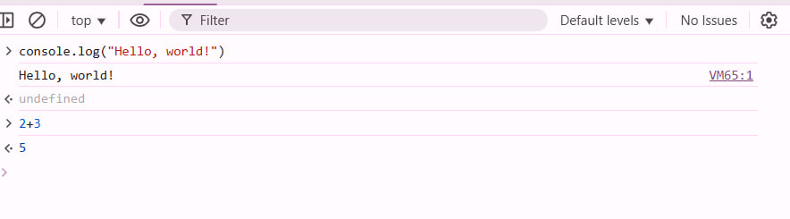
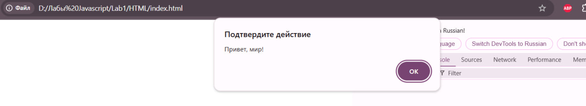
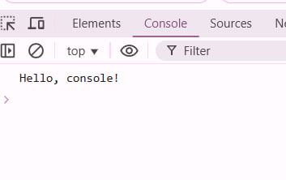
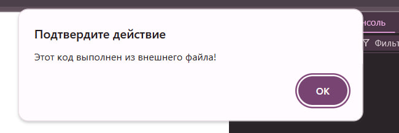
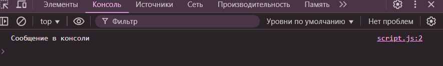
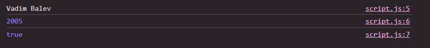
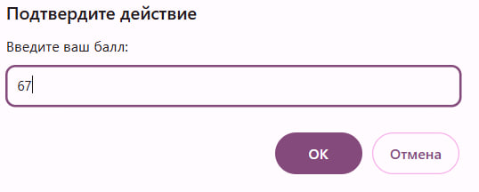
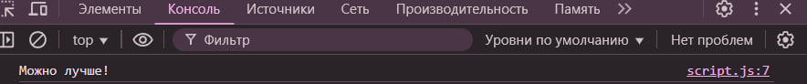
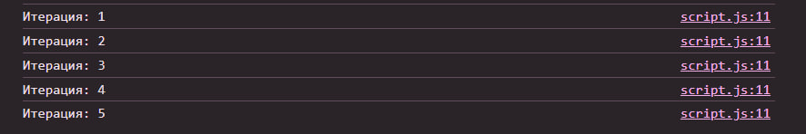

# Лабораторная работа №1

## Цель работы
### Познакомиться с основами JavaScript, научиться писать и выполнять код в браузере и в локальной среде, разобраться с базовыми конструкциями языка.

### Навигация

[Ход работы](#ход-работы)

[Контрольные вопросы](#контрольные-вопросы)

## Ход работы

1. Я открыл режим разработчика и ввел туда `console.log("Hello, world!")`, а затем ввел `2+3`.





2. Создал файл *index.html* и вставил код 
```js
<!DOCTYPE html>
<html lang="en">
 <head>
   <title>Привет, мир!</title>
 </head>
 <body>
   <script>
     alert("Привет, мир!");
     console.log("Hello, console!");
   </script>
 </body>
</html>
```

Результат выполнения кода:


`alert("Привет, мир!");`-вывводит предупреждение в браузере, с надписью "Привет, мир!".



`console.log("Hello, console!");`-выводит "Hello, console!" в консоль браузера.


3. Создал файл *script.js* с кодом 
```js
alert("Этот код выполнен из внешнего файла!");
console.log("Сообщение в консоли");
```

и связал его с *index.html* с помощью `<script src="script.js"></script>`.

Результат кода:





Принцип работы кода тот же, что был во втором пункте, но он теперь находится на отдельном файле для удобства и интуитивности.

4. Объявил несколько переменных:

**name** - мое имя.

**birthYear** - год рождения.

**isStudent** - логическая переменная, указывающая являюсь ли я студентом.

```js
name = "Vadim Balev"
birthYear = 2005;
isStudent = true;

console.log(name);
console.log(birthYear);
console.log(isStudent);
```



Вывел переменные в консоль.

5. Я вставил 

```js
let score = prompt("Введите ваш балл:");
if (score >= 90) {
 console.log("Отлично!");
} else if (score >= 70) {
 console.log("Хорошо");
} else {
 console.log("Можно лучше!");
}

for (let i = 1; i <= 5; i++) {
 console.log(`Итерация: ${i}`);
}
```

в свой файл *script.js*, чтобы проверить как рабоатают условия и циклы в Javascript. 

В первой части кода, а именно

```js
let score = prompt("Введите ваш балл:");
if (score >= 90) {
 console.log("Отлично!");
} else if (score >= 70) {
 console.log("Хорошо");
} else {
 console.log("Можно лучше!");
}
```

задействуются условия. Этот код проверяет балл студента, а затем в зависимости от балл выводит подходящее сообщение.

Например я ввел балл **67** и вот что вывела консоль:





Принцип работы схож с C++.

Во второй части кода

```js
for (let i = 1; i <= 5; i++) {
 console.log(`Итерация: ${i}`);
}
```

показана работа цикла **for** в Javascript.



Пока наша переменная <= 5 цикл будет повторяться и выводить **"Итерация: i"**, где i - значение переменной после каждой итерации. 

## Контрольные вопросы
### 1. Чем отличается *var* от *let* и *const*?

Объявление переменных через *var* является устаревшим способом. Одну и ту же переменную в *var* можно было объявлять несколько раз, в том числе одновременно внутри блоко {} и вне блока, что приводило к разного рода ошибкам с определением переменных.

*Let* - современный способ объявления перменных. Он позволяет объявлять переменные лишь единажды и не позволяет объявлять переменную вне блока {}. Переменную *let* можно изменять в отличие от *const*.

*Const* - современный способ объявления переменных, но с постоянными значениеми. Переременные *const* нельхя изменять, но для объектов и массивов можно изменять их свойства и элементы.

### 2. Что такое неявное преобразование типов в JavaScript?

При операциях между значениями разных типов происходит автоматическое преобразование одного из них к типу другого с помощью Javascript-движка для выполнения операции.

Например, если одно из значений — строка, остальные операнды тоже превращаются в строки.

При математических операциях (все, кроме +) строки становятся числами.

### 3. Как работает оператор == в сравнении с ===?

Оператор "==" сравнивает значения независимо от их типа, а "===" сравнивает значения в том числе по их типу.

Например, "37" == 37 даст *true*, а "37" === 37 даст false.


