#  Отчет о тестировании JavaScript-функций для работы с транзакциями

##  Введение  
В данном отчете представлены результаты тестирования функций, разработанных для работы с массивом транзакций. Проверяются корректность вычислений, фильтрации и поиска данных.
## Ход работы
### Шаг 1. Создание массива транзакций
---
Создан файл main.js, в котором размещен код для анализа транзакций. Массив объектов transactions содержит три транзакции, каждая из которых имеет следующие свойства:

- transaction_id: Уникальный идентификатор транзакции.
- transaction_date: Дата транзакции (в формате YYYY-MM-DD).
- transaction_amount: Сумма транзакции.
- transaction_type: Тип транзакции (debit или credit).
- transaction_description: Описание транзакции.
- merchant_name: Название магазина или сервиса.
- card_type: Тип карты (credit или debit).

```js
const transactions = [
  {
    transaction_id: "t1",
    transaction_date: "2023-10-01",
    transaction_amount: 150,
    transaction_type: "debit",
    transaction_description: "Покупка продуктов",
    merchant_name: "Магазин Продуктов",
    card_type: "credit",
  },
  {
    transaction_id: "t2",
    transaction_date: "2023-10-02",
    transaction_amount: 200,
    transaction_type: "credit",
    transaction_description: "Возврат средств",
    merchant_name: "Сервис Возвратов",
    card_type: "debit",
  }, {
    transaction_id: "t3",
    transaction_date: "2023-10-03",
    transaction_amount: 50,
    transaction_type: "debit",
    transaction_description: "Оплата услуг",
    merchant_name: "Услуги Онлайн",
    card_type: "debit",
  },
  
];
```

### Шаг 2. Реализация функций для анализа транзакций
---
**getUniqueTransactionTypes(transactions)**

Возвращает массив уникальных типов транзакций.
Используется Set для сбора уникальных значений типа транзакций.
```js
function getUniqueTransactionTypes(transactions) {
  const uniqueTypes = new Set(transactions.map((t) => t.transaction_type));
  return Array.from(uniqueTypes);
}
```

**calculateTotalAmount(transactions)**

Вычисляет общую сумму всех транзакций.
Используется метод .reduce() для суммирования значений transaction_amount.
```js
function calculateTotalAmount(transactions) {
  return transactions.reduce((total, t) => total + t.transaction_amount, 0);
}

```

**calculateTotalAmountByDate(transactions, year, month, day)**

Вычисляет общую сумму транзакций за указанный период (год, месяц, день). Параметры необязательны.
Фильтрация транзакций с использованием new Date() для сравнения дат.
```js
function calculateTotalAmountByDate(transactions, year, month, day) {
  return transactions
    .filter((t) => {
      const date = new Date(t.transaction_date);
      if (year !== undefined && date.getFullYear() !== year) return false;
      if (month !== undefined && date.getMonth() + 1 !== month) return false;
      if (day !== undefined && date.getDate() !== day) return false;
      return true;
    })
    .reduce((total, t) => total + t.transaction_amount, 0);
}
```

**getTransactionByType(transactions, type)**

Возвращает массив транзакций указанного типа (debit или credit).
Используется метод .filter() для фильтрации по transaction_type.
```js
function getTransactionByType(transactions, type) {
  return transactions.filter((t) => t.transaction_type === type);
}
```

**getTransactionsInDateRange(transactions, startDate, endDate)**

Возвращает массив транзакций, проведенных в указанном диапазоне дат.
Фильтрация транзакций с использованием new Date() для сравнения дат.
```js
function getTransactionsInDateRange(transactions, startDate, endDate) {
  return transactions.filter(
    (t) =>
      new Date(t.transaction_date) >= new Date(startDate) &&
      new Date(t.transaction_date) <= new Date(endDate)
  );
}
```

**getTransactionsByMerchant(transactions, merchantName)**

Возвращает массив транзакций, совершенных с указанным merchant_name.
Используется метод .filter() для фильтрации по merchant_name.
```js
function getTransactionsByMerchant(transactions, merchantName) {
  return transactions.filter((t) => t.merchant_name === merchantName);
}
```

**calculateAverageTransactionAmount(transactions)**

Вычисляет среднее значение сумм транзакций.
Используется метод .reduce() для суммирования и деления на количество транзакций.
```js
function calculateAverageTransactionAmount(transactions) {
  if (transactions.length === 0) return 0;
  const totalAmount = calculateTotalAmount(transactions);
  return totalAmount / transactions.length;
}
```

**getTransactionsByAmountRange(transactions, minAmount, maxAmount)**

Возвращает массив транзакций с суммой в указанном диапазоне.
Используется метод .filter() для фильтрации по transaction_amount.
```js
function getTransactionsByAmountRange(transactions, minAmount, maxAmount) {
  return transactions.filter(
    (t) => t.transaction_amount >= minAmount && t.transaction_amount <= maxAmount
  );
}
```

**calculateTotalDebitAmount(transactions)**

Вычисляет общую сумму дебетовых транзакций.
Используется метод .reduce() после фильтрации по debit.
```js
function calculateTotalDebitAmount(transactions) {
  return getTransactionByType(transactions, "debit").reduce(
    (total, t) => total + t.transaction_amount,
    0
  );
}
```

**findMostTransactionsMonth(transactions)**

Возвращает месяц с наибольшим количеством транзакций.
Подсчет количества транзакций по месяцам с использованием объекта счетчика.
```js
function findMostTransactionsMonth(transactions) {
  if (transactions.length === 0) return null;

  const monthCounts = {};
  transactions.forEach((t) => {
    const date = new Date(t.transaction_date);
    const month = date.getMonth() + 1;
    monthCounts[month] = (monthCounts[month] || 0) + 1;
  });

  let mostTransactionsMonth = null;
  let maxCount = 0;
  for (const [month, count] of Object.entries(monthCounts)) {
    if (count > maxCount) {
      mostTransactionsMonth = month;
      maxCount = count;
    }
  }

  return mostTransactionsMonth;
}
```

**findMostDebitTransactionMonth(transactions)**

Возвращает месяц с наибольшим количеством дебетовых транзакций.
Аналогично предыдущей функции, но с фильтрацией по debit.
```js
function findMostDebitTransactionMonth(transactions) {
  const debitTransactions = getTransactionByType(transactions, "debit");
  return findMostTransactionsMonth(debitTransactions);
}
```

**mostTransactionTypes(transactions)**

Возвращает тип транзакций, которых больше всего (debit, credit или equal).
Сравнение количества debit и credit транзакций.
```js
function mostTransactionTypes(transactions) {
  const debitCount = getTransactionByType(transactions, "debit").length;
  const creditCount = getTransactionByType(transactions, "credit").length;

  if (debitCount > creditCount) return "debit";
  if (creditCount > debitCount) return "credit";
  return "equal";
}
```

**getTransactionsBeforeDate(transactions, date)**

Возвращает массив транзакций, совершенных до указанной даты.
Фильтрация транзакций с использованием new Date().
```js
function getTransactionsBeforeDate(transactions, date) {
  return transactions.filter(
    (t) => new Date(t.transaction_date) < new Date(date)
  );
}
```

**findTransactionById(transactions, id)**

Возвращает транзакцию по её уникальному идентификатору.
Используется метод .find() для поиска по transaction_id.
```js
function findTransactionById(transactions, id) {
  return transactions.find((t) => t.transaction_id === id) || null;
}
```

**mapTransactionDescriptions(transactions)**

Возвращает массив описаний транзакций.
Используется метод .map() для извлечения transaction_description.
```js
function mapTransactionDescriptions(transactions) {
  return transactions.map((t) => t.transaction_description);
}
```

##  Тестовые данные  
Были использованы три транзакции:  

| ID  | Дата       | Сумма | Тип    | Описание          | Магазин/Сервис        | Карта  |
|-----|-----------:|------:|--------|-------------------|-----------------------|--------|
| t1  | 2023-10-01 |   150 | debit  | Покупка продуктов | Магазин Продуктов     | credit |
| t2  | 2023-10-02 |   200 | credit | Возврат средств   | Сервис Возвратов      | debit  |
| t3  | 2023-10-03 |    50 | debit  | Оплата услуг      | Услуги Онлайн         | debit  |


##  Результаты тестов  

### Основные тесты  
**Тесты в коде**
```js
console.log("Уникальные типы транзакций:", getUniqueTransactionTypes(transactions)); // ["debit", "credit"]
console.log("Общая сумма транзакций:", calculateTotalAmount(transactions)); // 400
console.log("Транзакции типа 'debit':", getTransactionByType(transactions, "debit")); // [{...}, {...}]
console.log("Транзакции в диапазоне дат:", getTransactionsInDateRange(transactions, "2023-10-01", "2023-10-02")); // [{...}, {...}]
console.log("Транзакции по магазину 'Магазин Продуктов':", getTransactionsByMerchant(transactions, "Магазин Продуктов")); // [{...}]
console.log("Среднее значение транзакций:", calculateAverageTransactionAmount(transactions)); // 133.33...
console.log("Транзакции в диапазоне сумм:", getTransactionsByAmountRange(transactions, 50, 200)); // [{...}, {...}, {...}]
console.log("Общая сумма дебетовых транзакций:", calculateTotalDebitAmount(transactions)); // 200
console.log("Месяц с наибольшим количеством транзакций:", findMostTransactionsMonth(transactions)); // 10
console.log("Месяц с наибольшим количеством дебетовых транзакций:", findMostDebitTransactionMonth(transactions)); // 10
console.log("Каких транзакций больше:", mostTransactionTypes(transactions)); // "equal"
console.log("Транзакции до указанной даты:", getTransactionsBeforeDate(transactions, "2023-10-02")); // [{...}]
console.log("Транзакция по ID 't2':", findTransactionById(transactions, "t2")); // {...}
console.log("Описания транзакций:", mapTransactionDescriptions(transactions)); // ["Покупка продуктов", "Возврат средств", "Оплата услуг"]
```
**Тесты в консоли**

- **Уникальные типы транзакций:** `["debit", "credit"]` 
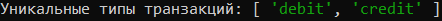  


- **Общая сумма транзакций:** `400`
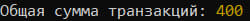
- **Фильтр: транзакции типа 'debit':** `[{t1}, {t3}]` 
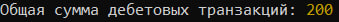
- **Фильтр: транзакции в диапазоне дат (01.10 - 02.10):** `[{t1}, {t2}]` 
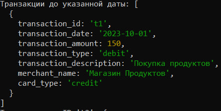
- **Фильтр: по магазину 'Магазин Продуктов':** `[{t1}]`
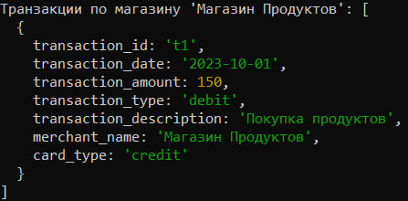   
- **Среднее значение транзакций:** `133.33...` 
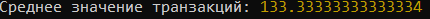     
- **Фильтр: транзакции в диапазоне сумм (50 - 200):** `[{t1}, {t2}, {t3}]`
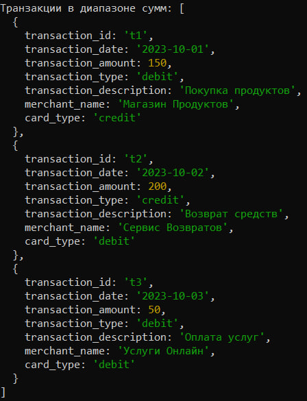      
- **Общая сумма дебетовых транзакций:** `200`  
    
- **Месяц с наибольшим числом транзакций:** `10`
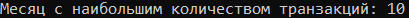      
- **Месяц с наибольшим числом дебетовых транзакций:** `10`  
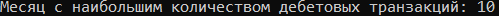    
- **Тип транзакций с наибольшим количеством:** `"debit"` 
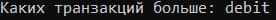     
- **Фильтр: транзакции до 02.10.2023:** `[{t1}]` 
     
- **Поиск транзакции по ID 't2':** `{t2}`  
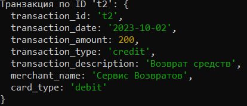    
- **Массив описаний транзакций:** `["Покупка продуктов", "Возврат средств", "Оплата услуг"]`   
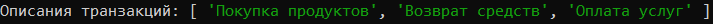   

###  Тесты с пустым массивом  
**Тесты в коде**
```js
console.log("Тест для пустого массива:");
console.log("Уникальные типы транзакций:", getUniqueTransactionTypes([])); // []
console.log("Общая сумма транзакций:", calculateTotalAmount([])); // 0
console.log("Среднее значение транзакций:", calculateAverageTransactionAmount([])); // 0
```
- **Уникальные типы транзакций:** `[]` 
     
- **Общая сумма транзакций:** `0`
     
- **Среднее значение транзакций:** `0`


- 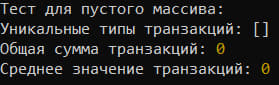     


## Контрольные вопросы


### 1. Какие методы массивов можно использовать для обработки объектов в JavaScript?

- **map()** – Создает новый массив, трансформируя каждый элемент.

- **filter()** – Возвращает новый массив с элементами, соответствующими условию.

- **reduce()** – Позволяет вычислять агрегированные значения (например, сумму).

- **forEach()** – Итерация по массиву без возврата нового массива.

- **find()** – Ищет первый элемент, соответствующий условию.

- **findIndex()** – Возвращает индекс первого найденного элемента.

- **some()** – Проверяет, есть ли хотя бы один элемент, удовлетворяющий условию.

- **every()** – Проверяет, соответствуют ли все элементы условию.

- **sort()** – Сортирует массив (по умолчанию лексикографически).

- **slice()** – Создает новый массив, копируя часть существующего.

- **splice()** – Изменяет массив: удаляет, добавляет или заменяет элементы.


### 2.Как сравнивать даты в строковом формате в JavaScript?
Строки в формате YYYY-MM-DD можно сравнивать как обычные строки, так как они упорядочены лексикографически.
```js
console.log("2024-01-01" > "2023-12-31"); 
```


Можно сравнить через метод **.parse()**:
```js
console.log(Date.parse("2024-01-04") > Date.parse("2024-03-08"));
```


### 3.В чем разница между map(), filter() и reduce() при работе с массивами объектов?
- **map()** - используется, если нужно изменить структуру объектов или нужно получить новый массив значений.
- **filter()** - используется, если нужно отсортировать элементы, исходя из требуемого условия.
- **reduce()** - исползуется для поиска определенного значения, исходя из данных массива, например для поиска среднего значения, вычисления суммы значений и тому подобное.


## Вывод 
Все тесты не вызвали проблем, функции работают корректно, обработка данных выполняется в соответствии с ожиданиями. В ходе лабораторной работы были также даны ответы на такие вопросы, как:
- какие методы можно применять к массивам объектов;
- как сравнивать дату;
- для чего обычно используют методы **map()** , **filter()** и **reduce()**.
