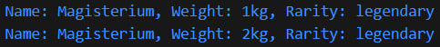
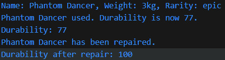
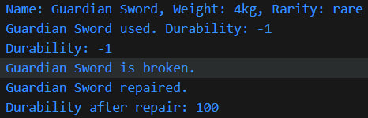

# Отчет по лабораторной работе впарарап
### Тема: Работа с классами и объектами в JavaScript
## Цель работы
Познакомиться с классами и объектами в JavaScript, научиться создавать классы, использовать конструкторы и методы, а также реализовать наследование.
### Шаг 1. Создание класса Item
***
Создан класс Item, представляющий предмет в инвентаре. Класс содержит следующие поля и методы:

Поля:
* name – название предмета (строка).
* weight – вес предмета (число).
* rarity – редкость предмета (common, uncommon, rare, legendary) (строка).

Методы:
* getInfo() – возвращает строку с информацией о предмете.
* setWeight(newWeight) – изменяет вес предмета.

Код:
```js
/**
 * @class Item
 * Представляет предмет в инвентаре.
 */
class Item {
    /**
     * @param {string} name - Название предмета.
     * @param {number} weight - Вес предмета.
     * @param {string} rarity - Редкость предмета (common, uncommon, rare, legendary).
     */
    constructor(name, weight, rarity) {
      this.name = name;
      this.weight = weight;
      this.rarity = rarity;
    }
  
    /**
     * Возвращает информацию о предмете.
     * @returns {string}
     */
    getInfo() {
      return `Name: ${this.name}, Weight: ${this.weight}kg, Rarity: ${this.rarity}`;
    }
  
    /**
     * Изменяет вес предмета.
     * @param {number} newWeight
     */
    setWeight(newWeight) {
      this.weight = newWeight;
    }
  }

```
### Шаг 2. Создание класса Weapon
***
Создан класс Weapon, который расширяет класс Item. Добавлены дополнительные поля и методы для работы с оружием.

Дополнительные поля:
* damage – урон оружия (число).
* durability – прочность (число от 0 до 100).

Методы:
* use() – уменьшает значение durability на 10 (если durability > 0). Если прочность равна 0, выводится сообщение о том, что оружие сломано.
* repair() – восстанавливает значение durability до 100.

### Тестирование 
***
#### Созданы несколько объектов классов Item и Weapon. Вызваны их методы для проверки корректности работы.
***
```js
  // Тестирование
  // Тестируем класс Item
const magisterium = new Item("Magisterium", 1, "legendary");
console.log(magisterium.getInfo()); 
magisterium.setWeight(2);
console.log(magisterium.getInfo()); 

// Тестируем класс Weapon
const phantomDancer = new Weapon("Phantom Dancer", 3, "epic", 35, 87);
console.log(phantomDancer.getInfo()); 
phantomDancer.use(); 
console.log(`Durability: ${phantomDancer.durability}`); 
phantomDancer.repair(); 
console.log(`Durability after repair: ${phantomDancer.durability}`); 
```
***

***

### Шаг 3. Реализация кода через функции-конструкторы
***
```js
function ItemFn(name, weight, rarity) {
    this.name = name;
    this.weight = weight;
    this.rarity = rarity;
}

ItemFn.prototype.getInfo = function () {
    return `Name: ${this.name}, Weight: ${this.weight}kg, Rarity: ${this.rarity}`;
};

ItemFn.prototype.setWeight = function (newWeight) {
    this.weight = newWeight;
};

function WeaponFn(name, weight, rarity, damage, durability) {
    ItemFn.call(this, name, weight, rarity);
    this.damage = damage;
    this.durability = durability;
}

WeaponFn.prototype = Object.create(ItemFn.prototype);
WeaponFn.prototype.constructor = WeaponFn;

WeaponFn.prototype.use = function () {
    if (this.durability > 0) {
        this.durability -= 10;
        console.log(`${this.name} used. Durability: ${this.durability}`);
    } else {
        console.log(`${this.name} is broken.`);
    }
};

WeaponFn.prototype.repair = function () {
    this.durability = 100;
    console.log(`${this.name} repaired.`);
};
```
### Тестирование кода функций-конструкторов
***
```js
 // Тестирование
// Тестируем функцию-конструктор ItemFn
const doranRing = new ItemFn("Doran Ring", 0.1, "epic");
console.log(doranRing.getInfo()); 

doranRing.setWeight(0.2);
console.log(doranRing.getInfo()); 

// Тестируем функцию-конструктор WeaponFn
const guardianSword = new WeaponFn("Guardian Sword", 4, "rare", 17, 9);
console.log(guardianSword.getInfo()); 

guardianSword.use(); 

console.log(`Durability: ${guardianSword.durability}`); 

guardianSword.use();

guardianSword.repair(); 
console.log(`Durability after repair: ${guardianSword.durability}`); 

```
***

***

### Шаг 4. Использование опциональной цепочки (?.)
```js
const unknownItem = null;
  console.log(unknownItem?.getInfo?.());
```
Опциональная цепочка **(?.)** позволяет безопасно обращаться к свойствам или методам объекта, даже если объект равен **null** или **undefined**, предотвращая ошибки выполнения. Если объект (или свойство) перед **?**. равно **null** или **undefined**, выражение возвращает **undefined** вместо того, чтобы выбрасывать ошибку. Программа не падает, а продолжает работу.
## Контрольные вопросы
### 1. Какое значение имеет this в методах класса?

this - ссылка на объект, который мы создали, чтобы потом обращаться к самому объекту и его свойствам.
***
### 2. Как работает модификатор доступа # в JavaScript?
Модификатор доступа # (решетка) используется для создания частных свойств и методов класса. Эти свойства и методы доступны только внутри класса, и их нельзя получить или изменить извне.
***
### 3. В чем разница между классами и функциями-конструкторами?
Классы :
* Используют ключевое слово class.
* Методы определяются с помощью function-подобного синтаксиса.
* Современный способ создания пользовательских объектов.

Функции-конструкторы:
* Используют обычную функцию с именем, которое начинается с большой буквы.
* Методы добавляются через прототип (prototype).
* Ипользуется в устаревших браузерах, чаще всего используется для более простых структур.

## Итог
В ходе выполнения лабораторной работы были успешно освоены основы работы с классами и объектами в JavaScript. Реализованы базовые классы **Item** и **Weapon**, а также их аналоги через функции-конструкторы. Проведено тестирование всех методов, подтверждена их корректная работа. Дополнительно изучены современные возможности языка, такие как опциональная цепочка **(?.)**.
